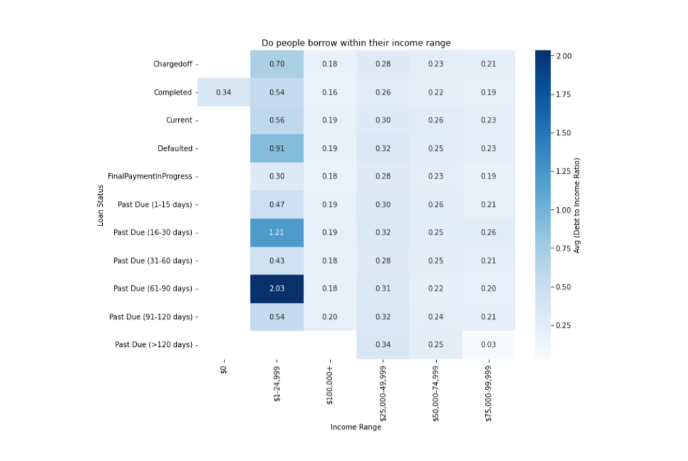
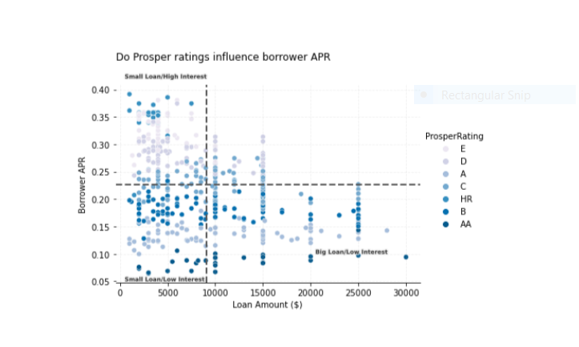
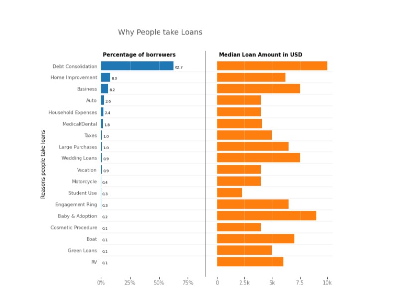

# Prosper_Loans_Analysis

## by Chinelo Cynthia Ezenwafor

***

## INTRODUCTION

> The **Prosper Loan** dataset contains information about 120,000 loaners that patronise prosper loans. It contains information stored in 81 variables about these customers. Data dictionary to understand the variables more can be found [here](https://docs.google.com/spreadsheets/d/1gDyi_L4UvIrLTEC6Wri5nbaMmkGmLQBk-Yx3z0XDEtI/edit#gid=0).

## Skills/concepts demonstrated:

Thr following python skills were incorporated; 
- Data wrangling, 
- Exploratory data analysis, 
- Explanatory data analysis

## Preliminary wrangling

> Of the 81 features in the dataset, 14 were selected for this analysis. After dataset assessment, some problems identified were incorrect data types, missing/null values and duplicate values. During cleaning, the data types were properly converted, and missing values were dropped. At the end of the wrangling, 84853 records and 14 variables remained for analysis. 

## Exploratory data analysis

### Summary of Findings

> * From exploring the dataset, it can be observed that there is a negative relationship between borrower APR and features such as Prosper ratings and loan amount. Taking a large amount of loan means a borrower get a lower interest rate as opposed to taking a smaller loan. Also, borrowers who have high prosper ratings tend to get a lower interest rate as opposed to those who do not.

> * It was also observed factors that certain factors can influence a borrower's ratings such as employment status, stated monthly income/income range and debt to income ratio. Borrowers who are home owners, employed and have high income range tend to get higher ratings than others.

> * Some of the reasons why people take a loan was analysed, and it was observed that majority of borrowers take loans to offset previous loans(debt consolidation). Other reasons include; home improvment, buy a car, business, home improvemnt, etc.

> * It can also be observed that most of the borrowers are employed and earn between 25-75k dollars annually. Most borrowers prefer to take loans in multiples of 5000 as well.

> * Also, it can be seen that borrowers who earn between 1-25k dollars tend to take more loans than their income (high debt to income ratio) and are also the most defaulters in paying back their loans. 

## Explanatory data analysis

## Key Insights for analysis

> * Do people borrow money within their income range? 

>* From the plot, it can be obseved that borrowers who earn between 1-24.999k dollars, tend to have high debt to income ratio(>= 0.5), it can also be seen that majority of these group are owing loans past their due date. Borrowers who earn from 25k and above, tend to keep their loan appropriate to their income.
***

> * Do loan amount taken and prosper ratings influence a borrower's annual percentage rate?

>* From the plot, we can observe the relationship between the three variables. Borrowers with high prosper ratings are opportuned to take loans (both large and small) at lower interest rates, while borrowers with low prosper ratings mostly take smaller loans but get higher interest rates.
***

> * Main reasons why people take a loan?

>* From the plot, 62.7% of the borrowers take loans to pay off existing loans up to the tune of over 10k dollars. Also, it can be seen that people take huge loans to finance things like weddings, baby and adoption and engagement ring. 6.2% of the borrowers take up to 7.5k dollars loans to finance their business.

## Conclusion and Recommendation

>* Analysing this dataset came with a lot of challenges, the foremost being the sheer size of the dataset. However, I had to select the variables that were relevant to the insights I wished to analyze, and these insights helped us to analyze our customer's financial habits. Some information hidden inside the deliquency variables and late payment variables with respect to the monthly loan ammount is also a good part of the data thta can be analysed further.
